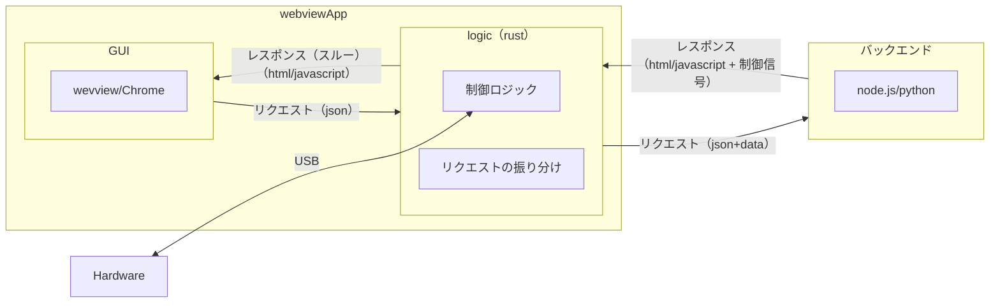
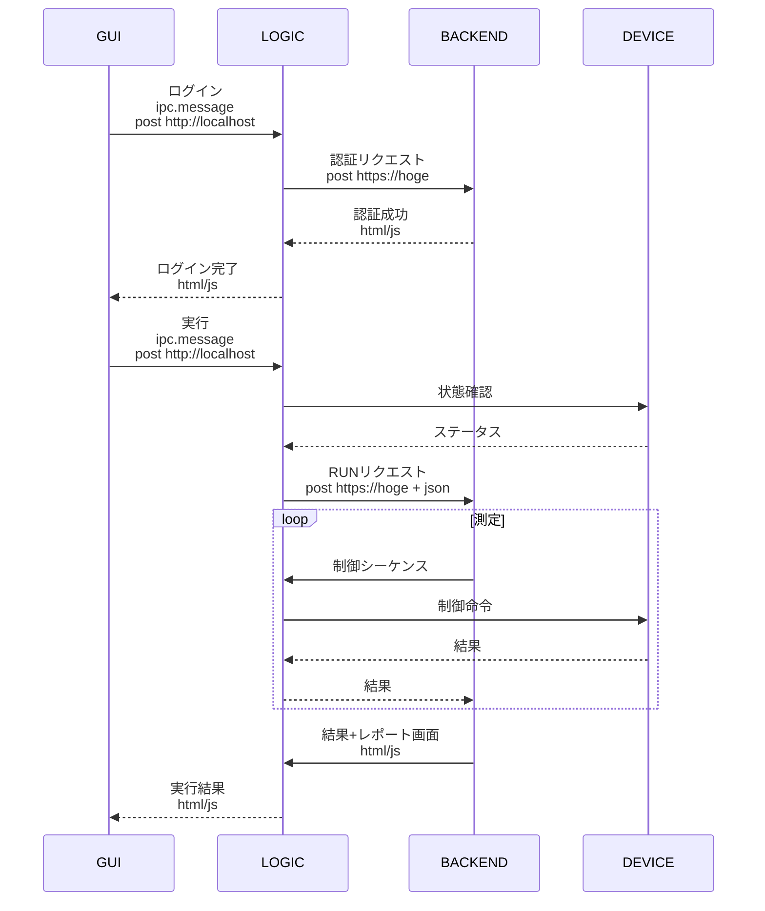

# test

```mermaid
flowchart RL
  subgraph webviewApp
    subgraph front[GUI]
      wv[wevview/Chrome]
    end
    subgraph logic[logic（rust）]
      制御ロジック
      リクエストの振り分け
    end
  end
  subgraph back[バックエンド]
    node.js/python
  end
  制御ロジック <-->|USB| Hardware
  front -->|リクエスト（json）| logic
  logic -->|リクエスト（json+data）| back
  back -->|レスポンス（html/javascript + 制御信号）| logic
  logic -->|レスポンス（スルー）（html/javascript）| front
```

```mermaid
sequenceDiagram
  participant GUI
  participant LOGIC
  participant BACKEND
  participant DEVICE
  GUI ->> LOGIC : ログイン<br>ipc.message<br>post http://localhost
  LOGIC ->> BACKEND : 認証リクエスト<br>post https://hoge
  BACKEND -->> LOGIC : 認証成功<br>html/js
  LOGIC -->> GUI : ログイン完了<br>html/js
  GUI ->> LOGIC : 実行<br>ipc.message<br>post http://localhost
  LOGIC ->> DEVICE : 状態確認
  DEVICE -->> LOGIC : ステータス
  LOGIC ->> BACKEND : RUNリクエスト<br>post https://hoge  + json
  loop 測定
    BACKEND ->> LOGIC : 制御シーケンス
    LOGIC ->> DEVICE : 制御命令
    DEVICE -->> LOGIC : 結果
    LOGIC -->> BACKEND : 結果
  end
  BACKEND ->> LOGIC : 結果+レポート画面<br>html/js
  LOGIC -->> GUI : 実行結果<br>html/js
```
